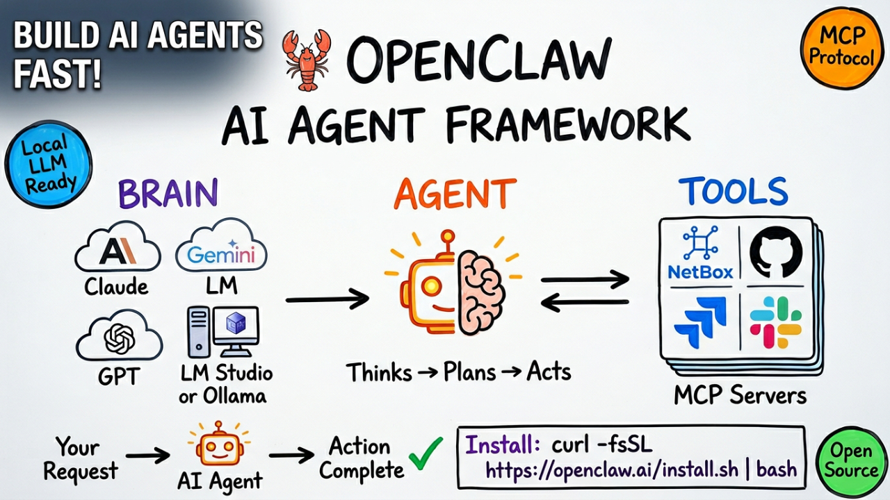

<p align="center">
  <a href="https://git.io/typing-svg">
    
  </a>
</p>

<p align="center">
  
</p>

<p align="center">
  
  
  
  
  
</p>

<p align="center">
  <a href="https://docs.openclaw.ai"></a>
  <a href="https://openclaw.ai/showcase"></a>
  <a href="https://github.com/openclaw-ai/openclaw"></a>
</p>

---

## 🎯 What is OpenClaw?

OpenClaw is an AI Agent framework that connects LLMs (Claude, Gemini, GPT, Local Models) to your tools via MCP (Model Context Protocol). Build autonomous agents that can query databases, manage infrastructure, create tickets, and more.

### Three Layers of OpenClaw

| Layer | Component | Description |
|-------|-----------|-------------|
| 🧠 **Brain** | LLM | Claude, Gemini, GPT, or Local Models |
| 🤲 **Hands** | MCP Tools | Connect to NetBox, Jira, GitHub, etc. |
| 📚 **Expertise** | Skills | Instructions for when/how to use tools |

---

## 📋 Table of Contents

1. [Prerequisites](#-prerequisites)
2. [Installation](#-installation)
3. [Configuration](#-configuration)
4. [Service Management](#-service-management)
5. [Web UI / Dashboard](#-web-ui--dashboard)
6. [Model Providers](#-model-providers)
7. [Configuration Files](#-configuration-files)
8. [MCP Integration](#-mcp-integration)
9. [Skills](#-skills)
10. [Troubleshooting](#-troubleshooting)
11. [Logs](#-logs)
12. [Uninstallation](#-uninstallation)
13. [Common Issues & Solutions](#-common-issues--solutions)

---

## 🛠️ Tech Stack


---

## 📦 Prerequisites

| Requirement | Details |
|-------------|---------|
| **OS** | Linux (Ubuntu 22.04+) or macOS |
| **Node.js** | v22+ (auto-installed if missing) |
| **RAM** | 4GB+ minimum |
| **LLM Provider** | API key (Anthropic/Google/OpenAI) OR local LLM (LM Studio) |

---

## 🚀 Installation

### One-Line Install

```bash
curl -fsSL https://openclaw.ai/install.sh | bash
```

<details>
<summary>📝 What the Installer Does</summary>

```bash
# 1. Detects OS (Linux/macOS)
# 2. Checks/installs Node.js v22+
# 3. Installs build tools (make, g++, cmake, python3)
# 4. Configures npm for user-local installs
# 5. Installs OpenClaw npm package
# 6. Runs setup wizard
# 7. Installs systemd service
```

</details>

<details>
<summary>⚙️ Installation Wizard Options</summary>

| Step | Prompt | Recommended Selection |
|------|--------|----------------------|
| 1 | Security warning | **Yes** |
| 2 | Onboarding mode | **QuickStart** |
| 3 | Model/auth provider | **vLLM** (local) or **Google** (cloud) |
| 4 | vLLM base URL | `http://<LM_STUDIO_IP>:1234/v1` |
| 5 | API Key | `lm-studio` or your API key |
| 6 | Model | `qwen2.5-coder-3b-instruct` |
| 7 | Default model | **Keep current** |
| 8 | Gateway port | **18789** (default) |
| 9 | Gateway bind | **Loopback (127.0.0.1)** |
| 10 | Gateway auth | **Token** |
| 11 | Tailscale exposure | **Off** |
| 12 | Gateway token | **(blank - auto-generate)** |
| 13 | Configure channels | **No** (skip for now) |
| 14 | Configure skills | **No** (skip for now) |
| 15 | Enable hooks | **Skip for now** |
| 16 | Install Gateway service | **Yes** |
| 17 | Gateway runtime | **Node** |
| 18 | Hatch bot | **Do this later** |

</details>

<details>
<summary>🔧 Post-Installation: Fix PATH</summary>

```bash
# Add npm global bin to PATH
echo 'export PATH="$HOME/.npm-global/bin:$PATH"' >> ~/.bashrc
source ~/.bashrc

# Verify installation
openclaw --version
# Expected output: 2026.2.26
```

</details>

---

## ⚙️ Configuration

### Configure Wizard

<details>
<summary>1. Full Configuration Wizard</summary>

```bash
openclaw configure
```

Interactive wizard for all settings.

</details>

<details>
<summary>2. Configure Specific Sections</summary>

```bash
# Model configuration only
openclaw configure --section model

# Web search configuration
openclaw configure --section web

# Channel configuration (Slack, Discord, etc.)
openclaw configure --section channels
```

</details>

<details>
<summary>3. Get/Set Config Values</summary>

```bash
# Get a config value
openclaw config get gateway.auth.token
openclaw config get agents.defaults.model.primary

# Set a config value
openclaw config set agents.defaults.model.primary "qwen2.5-coder-3b-instruct"

# Remove a config value
openclaw config unset some.config.key
```

</details>

<details>
<summary>4. View Full Config</summary>

```bash
# View entire config
cat ~/.openclaw/openclaw.json

# Pretty print
cat ~/.openclaw/openclaw.json | python3 -m json.tool

# Validate JSON syntax
cat ~/.openclaw/openclaw.json | python3 -m json.tool > /dev/null && echo "Valid JSON"
```

</details>

---

## 🔄 Service Management

### Systemd Commands

<details>
<summary>1. Check Status</summary>

```bash
systemctl --user status openclaw-gateway

# Expected output:
# ● openclaw-gateway.service - OpenClaw Gateway (v2026.2.26)
#      Active: active (running)
```

</details>

<details>
<summary>2. Start / Stop / Restart</summary>

```bash
# Start gateway
systemctl --user start openclaw-gateway

# Stop gateway
systemctl --user stop openclaw-gateway

# Restart gateway (after config changes)
systemctl --user restart openclaw-gateway
```

</details>

<details>
<summary>3. Enable / Disable on Boot</summary>

```bash
# Enable on boot
systemctl --user enable openclaw-gateway

# Disable on boot
systemctl --user disable openclaw-gateway
```

</details>

<details>
<summary>4. Reload After Config Changes</summary>

```bash
# Reload systemd daemon
systemctl --user daemon-reload

# Then restart gateway
systemctl --user restart openclaw-gateway
```

</details>

<details>
<summary>5. Manual Gateway Control</summary>

```bash
# Start gateway manually (foreground)
openclaw gateway

# Stop gateway
openclaw gateway stop
```

</details>

---

## 🌐 Web UI / Dashboard

<details>
<summary>1. Open Dashboard</summary>

```bash
# Opens browser automatically
openclaw dashboard

# Get URL without opening browser
openclaw dashboard --no-open
```

</details>

<details>
<summary>2. Access URLs</summary>

```
Web UI:           http://127.0.0.1:18789/
Web UI (token):   http://127.0.0.1:18789/#token=YOUR_TOKEN_HERE
Gateway WS:       ws://127.0.0.1:18789
```

</details>

<details>
<summary>3. Get Gateway Token</summary>

```bash
# Get current token
openclaw config get gateway.auth.token

# Note: Shows __OPENCLAW_REDACTED__ for security
# Check config file directly:
cat ~/.openclaw/openclaw.json | grep -A1 '"token"'
```

</details>

<details>
<summary>4. Generate New Token</summary>

```bash
openclaw doctor --generate-gateway-token
```

</details>

<details>
<summary>5. Chat Commands (in Web UI)</summary>

| Command | Action |
|---------|--------|
| `/new` | Start new session |
| `/reset` | Reset conversation |
| `/models` | List available models |
| `/help` | Show help |

</details>

---

## 🤖 Model Providers

### Cloud Providers

<details>
<summary>1. Google Gemini (Free Tier Available)</summary>

```bash
# Get API key from: https://aistudio.google.com

# Configure
openclaw configure --section model

# Select:
# Provider: Google
# API Key: <paste your key>
# Model: google/gemini-2.5-flash (recommended)
```

**Free Tier Limits:**
- ~60 requests/minute
- ~1500 requests/day

</details>

<details>
<summary>2. Anthropic Claude</summary>

```bash
# Get API key from: https://console.anthropic.com

# Configure
openclaw configure --section model

# Select:
# Provider: Anthropic
# API Key: <paste your key>
# Model: anthropic/claude-sonnet-4-6

# Note: Requires API credits ($5 minimum)
```

</details>

<details>
<summary>3. OpenAI</summary>

```bash
# Get API key from: https://platform.openai.com

# Configure
openclaw configure --section model

# Select:
# Provider: OpenAI
# API Key: <paste your key>
# Model: openai/gpt-4o

# Note: Requires API credits
```

</details>

### Local LLM (LM Studio)

<details>
<summary>1. LM Studio Setup (Windows/Mac)</summary>

```bash
# 1. Download LM Studio from: https://lmstudio.ai

# 2. Load a model (recommended):
#    - qwen2.5-coder-3b-instruct (fast, small)
#    - qwen2.5-coder-7b-instruct (balanced)

# 3. Go to Developer tab

# 4. Configure Server Settings:
#    - Context Length: 16384 (IMPORTANT - minimum required)
#    - Enable: "Serve on Local Network"

# 5. Click "Start Server"

# 6. Note the IP address (e.g., 192.168.1.100)
```

</details>

<details>
<summary>2. Configure OpenClaw for LM Studio</summary>

```bash
# Run configure wizard
openclaw configure --section model

# Select these options:
# Provider: vLLM
# vLLM base URL: http://192.168.1.100:1234/v1  (your LM Studio IP)
# API Key: lm-studio
# Model: qwen2.5-coder-3b-instruct

# Restart gateway
systemctl --user restart openclaw-gateway
```

</details>

<details>
<summary>3. Test LM Studio Connection</summary>

```bash
# From your Linux machine:
curl http://192.168.1.100:1234/v1/models

# Expected output:
{
  "data": [
    {
      "id": "qwen2.5-coder-3b-instruct",
      "object": "model",
      "owned_by": "organization_owner"
    }
  ],
  "object": "list"
}
```

</details>

<details>
<summary>4. LM Studio Recommended Settings</summary>

| Setting | Value | Notes |
|---------|-------|-------|
| **Context Length** | 16384 | Minimum for OpenClaw (large system prompt) |
| **GPU Offload** | Max available | More = faster |
| **Serve on Local Network** | Enabled | Required for remote access |
| **Model** | qwen2.5-coder-3b-instruct | Best balance speed/quality |

</details>

---

## 📁 Configuration Files

### Main Config File

<details>
<summary>Location & Structure</summary>

**Location:** `~/.openclaw/openclaw.json`

```json
{
  "wizard": {
    "lastRunAt": "2026-02-27T16:17:26.098Z",
    "lastRunVersion": "2026.2.26"
  },
  "auth": {
    "profiles": {
      "vllm:default": {
        "provider": "vllm",
        "mode": "api_key"
      }
    }
  },
  "agents": {
    "defaults": {
      "model": {
        "primary": "vllm/qwen2.5-coder-3b-instruct"
      },
      "workspace": "/home/user/.openclaw/workspace",
      "maxConcurrent": 4
    }
  },
  "gateway": {
    "port": 18789,
    "mode": "local",
    "bind": "loopback",
    "auth": {
      "mode": "token",
      "token": "your-token-here"
    }
  }
}
```

</details>

### Systemd Service Override

<details>
<summary>Add Environment Variables</summary>

**Location:** `~/.config/systemd/user/openclaw-gateway.service.d/override.conf`

```bash
# Create directory
mkdir -p ~/.config/systemd/user/openclaw-gateway.service.d/

# Create override file
nano ~/.config/systemd/user/openclaw-gateway.service.d/override.conf
```

**Content:**

```ini
[Service]
Environment="OPENAI_BASE_URL=http://192.168.1.100:1234/v1"
Environment="OPENAI_API_BASE=http://192.168.1.100:1234/v1"
Environment="OPENAI_API_KEY=lm-studio"
```

**Apply changes:**

```bash
systemctl --user daemon-reload
systemctl --user restart openclaw-gateway
```

</details>

### Key Directories

<details>
<summary>Directory Structure</summary>

```bash
~/.openclaw/
├── openclaw.json           # Main config
├── openclaw.json.bak       # Config backup
├── workspace/              # Agent workspace
│   └── skills/             # Custom skills
└── agents/
    └── main/
        └── sessions/       # Session history
            └── sessions.json

~/.config/systemd/user/
├── openclaw-gateway.service
└── openclaw-gateway.service.d/
    └── override.conf       # Environment overrides

/tmp/openclaw/
└── openclaw-YYYY-MM-DD.log # Daily log files
```

</details>

---

## 🔌 MCP Integration

### NetBox MCP Example

<details>
<summary>1. Install NetBox MCP</summary>

```bash
pip install netbox-mcp
```

</details>

<details>
<summary>2. Add to OpenClaw Config</summary>

Edit `~/.openclaw/openclaw.json`:

```json
{
  "mcpServers": {
    "netbox": {
      "command": "uvx",
      "args": ["netbox-mcp"],
      "env": {
        "NETBOX_URL": "http://your-netbox:8000",
        "NETBOX_TOKEN": "your-api-token"
      }
    }
  }
}
```

</details>

<details>
<summary>3. Restart and Test</summary>

```bash
# Restart gateway
systemctl --user restart openclaw-gateway

# Open dashboard
openclaw dashboard

# Test in chat:
# "Show me all devices in NetBox"
# "List routers in site DC1"
```

</details>

---

## 📚 Skills

### Skill File Structure

<details>
<summary>Create Custom Skill</summary>

**Location:** `~/.openclaw/workspace/skills/inventory_audit.yaml`

```yaml
name: inventory_audit
description: "Audit NetBox inventory for missing information"
version: "1.0"

trigger:
  - "audit inventory"
  - "check my infrastructure"
  - "inventory health check"

tools:
  - netbox

instructions: |
  When user asks to audit inventory:
  1. Query all devices from NetBox
  2. Check for missing: primary IP, site, device role, platform
  3. Compile summary report:
     - Total devices checked
     - Devices with issues (list each)
     - Devices complete
  4. Provide actionable recommendations
  5. Offer to fix issues if user approves

examples:
  - user: "audit my inventory"
    assistant: "I'll check all devices for completeness..."
```

</details>

---

## 🔧 Troubleshooting

### Doctor Command

<details>
<summary>Run Diagnostics</summary>

```bash
# Run diagnostics
openclaw doctor

# Fix common issues
openclaw doctor --fix

# Generate new gateway token
openclaw doctor --generate-gateway-token
```

</details>

### Security Audit

<details>
<summary>Security Commands</summary>

```bash
# Deep security scan
openclaw security audit --deep

# Auto-fix security issues
openclaw security audit --fix
```

</details>

### Common Checks

<details>
<summary>Verification Commands</summary>

```bash
# Check if gateway is running
systemctl --user status openclaw-gateway

# Check OpenClaw version
openclaw --version

# Test LLM connection (for local LLM)
curl http://<LLM_IP>:1234/v1/models

# Check config file syntax
cat ~/.openclaw/openclaw.json | python3 -m json.tool

# Check gateway logs
journalctl --user -u openclaw-gateway -n 20
```

</details>

---

## 📜 Logs

<details>
<summary>1. View Gateway Logs</summary>

```bash
# Recent logs (last 50 lines)
journalctl --user -u openclaw-gateway -n 50

# Follow logs in real-time
journalctl --user -u openclaw-gateway -f

# Logs since today
journalctl --user -u openclaw-gateway --since today

# Logs with full output (no truncation)
journalctl --user -u openclaw-gateway -n 100 --no-pager
```

</details>

<details>
<summary>2. Log File Location</summary>

```bash
# OpenClaw writes logs to:
cat /tmp/openclaw/openclaw-$(date +%Y-%m-%d).log

# List all log files
ls -la /tmp/openclaw/
```

</details>

<details>
<summary>3. Debug Specific Issues</summary>

```bash
# Check for model errors
journalctl --user -u openclaw-gateway | grep -i "error\|fail"

# Check model being used
journalctl --user -u openclaw-gateway | grep "agent model"

# Check connection issues
journalctl --user -u openclaw-gateway | grep -i "connect\|timeout"
```

</details>

---

## 🗑️ Uninstallation

<details>
<summary>Complete Removal</summary>

```bash
# Step 1: Stop services
openclaw gateway stop
systemctl --user stop openclaw-gateway
systemctl --user disable openclaw-gateway

# Step 2: Remove npm package
npm uninstall -g openclaw

# Step 3: Remove config and data
rm -rf ~/.openclaw
rm -rf ~/.config/systemd/user/openclaw-gateway.service
rm -rf ~/.config/systemd/user/openclaw-gateway.service.d

# Step 4: Reload systemd
systemctl --user daemon-reload

# Step 5: Verify removal
openclaw --version
# Expected: command not found
```

</details>

<details>
<summary>Keep Config, Remove Package Only</summary>

```bash
# Remove package only (keeps config)
npm uninstall -g openclaw

# Reinstall later:
curl -fsSL https://openclaw.ai/install.sh | bash
# Config will be detected and preserved
```

</details>

---

## ❌ Common Issues & Solutions

<details>
<summary>Issue 1: "Command not found"</summary>

**Problem:** `openclaw: command not found`

**Cause:** PATH not updated after installation

**Solution:**
```bash
# Add to PATH
echo 'export PATH="$HOME/.npm-global/bin:$PATH"' >> ~/.bashrc
source ~/.bashrc

# Verify
openclaw --version
```

</details>

<details>
<summary>Issue 2: Gateway Offline / Disconnected</summary>

**Problem:** Web UI shows "Health Offline" or "Disconnected"

**Cause:** Gateway not running or token mismatch

**Solution:**
```bash
# Check status
systemctl --user status openclaw-gateway

# Restart
systemctl --user restart openclaw-gateway

# Use token URL
openclaw dashboard
```

</details>

<details>
<summary>Issue 3: "Cannot truncate prompt" Error</summary>

**Problem:** `Cannot truncate prompt with n_keep (14663) >= n_ctx (4096)`

**Cause:** LM Studio context window too small for OpenClaw's system prompt

**Solution:**
1. Open LM Studio
2. Go to Developer → Server Settings
3. Increase **Context Length** to **16384** or higher
4. Reload model
5. Restart server

</details>

<details>
<summary>Issue 4: Client Timeout Loop (Local LLM)</summary>

**Problem:** Processing keeps restarting, never completes. Logs show:
```
Client disconnected. Stopping generation...
Progress: 31.3% → Reset to 0.0%
```

**Cause:** OpenClaw times out while waiting for slow local LLM

**Solutions:**
1. Use smaller model (3B instead of 7B)
2. Increase GPU offload in LM Studio
3. Use cloud API instead (Gemini free tier)
4. Don't refresh browser while processing

</details>

<details>
<summary>Issue 5: "Incorrect API Key" Error</summary>

**Problem:** `401 Incorrect API key provided: lm-studio`

**Cause:** Using OpenAI provider but pointing to local LLM

**Solution:**
```bash
# Reconfigure with vLLM provider
openclaw configure --section model

# Select: vLLM (not OpenAI)
# This properly handles local LLM endpoints
```

</details>

<details>
<summary>Issue 6: Rate Limit (429 Too Many Requests)</summary>

**Problem:** Gemini API rate limited

**Cause:** Exceeded free tier limits

**Solutions:**
1. Wait 1-2 minutes (rate limit resets)
2. Use `gemini-2.5-flash-lite` (lower limits)
3. Add billing to Google AI Studio
4. Switch to different provider

</details>

<details>
<summary>Issue 7: Config Validation Error</summary>

**Problem:** `Unrecognized keys` or `Invalid config`

**Cause:** Manual config edit with wrong keys

**Solution:**
```bash
# Restore backup
cp ~/.openclaw/openclaw.json.bak ~/.openclaw/openclaw.json

# Or run doctor
openclaw doctor --fix

# Reconfigure
openclaw configure
```

</details>

---

## 📋 Quick Reference Card

### Essential Commands

| Task | Command |
|------|---------|
| **Install** | `curl -fsSL https://openclaw.ai/install.sh \| bash` |
| **Configure** | `openclaw configure` |
| **Configure Model** | `openclaw configure --section model` |
| **Start** | `systemctl --user start openclaw-gateway` |
| **Stop** | `systemctl --user stop openclaw-gateway` |
| **Restart** | `systemctl --user restart openclaw-gateway` |
| **Status** | `systemctl --user status openclaw-gateway` |
| **Dashboard** | `openclaw dashboard` |
| **Logs (follow)** | `journalctl --user -u openclaw-gateway -f` |
| **Logs (recent)** | `journalctl --user -u openclaw-gateway -n 50` |
| **Version** | `openclaw --version` |
| **Help** | `openclaw --help` |
| **Doctor** | `openclaw doctor` |
| **Doctor Fix** | `openclaw doctor --fix` |
| **Uninstall** | `npm uninstall -g openclaw && rm -rf ~/.openclaw` |

### Key File Locations

| File | Location |
|------|----------|
| Main config | `~/.openclaw/openclaw.json` |
| Config backup | `~/.openclaw/openclaw.json.bak` |
| Workspace | `~/.openclaw/workspace/` |
| Skills | `~/.openclaw/workspace/skills/` |
| Sessions | `~/.openclaw/agents/main/sessions/` |
| Systemd service | `~/.config/systemd/user/openclaw-gateway.service` |
| Service override | `~/.config/systemd/user/openclaw-gateway.service.d/override.conf` |
| Logs | `/tmp/openclaw/openclaw-YYYY-MM-DD.log` |

### Web UI Chat Commands

| Command | Action |
|---------|--------|
| `/new` | Start new session |
| `/reset` | Reset conversation |
| `/models` | List available models |
| `/model <name>` | Switch model |
| `/help` | Show help |

---

## 🔗 Resources

| Resource | Link |
|----------|------|
| **Documentation** | [docs.openclaw.ai](https://docs.openclaw.ai) |
| **Security Guide** | [docs.openclaw.ai/gateway/security](https://docs.openclaw.ai/gateway/security) |
| **Showcase** | [openclaw.ai/showcase](https://openclaw.ai/showcase) |
| **MCP Protocol** | [modelcontextprotocol.io](https://modelcontextprotocol.io) |
| **LM Studio** | [lmstudio.ai](https://lmstudio.ai) |
| **Google AI Studio** | [aistudio.google.com](https://aistudio.google.com) |
| **Anthropic Console** | [console.anthropic.com](https://console.anthropic.com) |

---

## 📝 Changelog

### v1.0 (2026-02-28)
- ✅ Complete installation guide
- ✅ vLLM/LM Studio integration
- ✅ Google Gemini setup
- ✅ Anthropic Claude setup
- ✅ Systemd service management
- ✅ Troubleshooting guide (7 issues)
- ✅ MCP integration example
- ✅ Skills documentation
- ✅ Quick reference card

---

⭐ **If you find this helpful, please star the repo!** ⭐
